# Gitter

A deterministic, Git-inspired Version Control System implemented as a
production-style engineering evaluation artifact.

Gitter demonstrates content-addressable object storage, branch and HEAD
management, staging semantics, commit graph traversal, and strict CLI
contract compliance: implemented from first principles.

------------------------------------------------------------------------

## Table of Contents

1.  [Overview](#overview)
2.  [Design Goals](#design-goals)
3.  [High-Level Architecture](#high-level-architecture)
4.  [Repository Layout](#repository-layout)
5.  [Object Model](#object-model)
    -   [Blob](#blob)
    -   [Tree](#tree)
    -   [Commit](#commit)
6.  [Installation](#installation)
    -   [Development Setup](#development-setup)
    -   [Run Tests](#run-tests)
7.  [Quickstart](#quickstart)
8.  [Supported Commands](#supported-commands)
9.  [Branch & Commit Graph Model](#branch--commit-graph-model)
10. [Reset Semantics](#reset-semantics)
11. [Checkout Semantics](#checkout-semantics)
12. [Performance Considerations](#performance-considerations)
13. [Testing Strategy](#testing-strategy)
    -   [Unit Tests](#1-unit-tests)
    -   [CLI Tests](#2-cli-tests)
    -   [Regex Compliance Tests](#3-regex-compliance-tests)
    -   [Integration Flows](#4-integration-flows)
14. [CI / Quality Gates](#ci--quality-gates)
15. [Architectural Layers](#architectural-layers)
16. [License](#license)
17. [Future Enhancements](#future-enhancements)

------------------------------------------------------------------------

## Overview

Gitter is a minimal yet architecturally rigorous version control CLI
tool.

It models the essential primitives of Git:

-   Content-addressable object storage (SHA-1)
-   Blob, Tree, and Commit object model
-   Staging area (index)
-   Branch references
-   HEAD pointer semantics
-   Reset and checkout behavior
-   Deterministic CLI output formatting (regex validated)

The system is layered, test-driven, and fully validated through strict
unit, regex, and integration test suites.

------------------------------------------------------------------------

## Design Goals

-   Deterministic filesystem-based repository layout
-   Explicit separation of concerns across layers
-   Zero hidden state or magic behavior
-   Strict CLI output compliance (regex-enforced)
-   ≥90% unit test code coverage enforcement
-   Production-style CI quality gates
-   Clear commit graph traversal logic
-   Predictable branch pointer semantics

------------------------------------------------------------------------

## High-Level Architecture

Gitter follows a strictly layered architecture designed to isolate
responsibilities and guarantee deterministic behavior. Each layer has a
single, well-defined purpose and does not leak implementation details
upward.

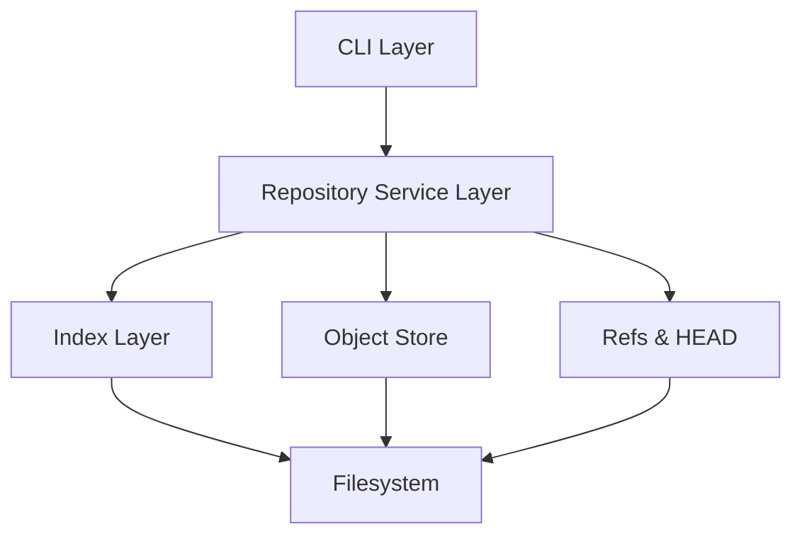

### Layer Responsibilities

-   CLI Layer parses arguments and enforces strict output formatting contracts.
-   Repository Service Layer orchestrates operations across subsystems.
-   Index Layer manages staging area persistence.
-   Object Store implements content-addressable storage using SHA-1.
-   Refs & HEAD Layer maintains branch pointer semantics.

All persistent state ultimately resolves to filesystem writes.

------------------------------------------------------------------------

## Repository Layout

Gitter repositories are fully filesystem-backed and deterministic.

    repo/
     ├── .gitter/
     │    ├── objects/        # content-addressable object store
     │    ├── refs/
     │    │    └── heads/     # branch pointers
     │    ├── HEAD            # symbolic ref
     │    └── index           # staging area
     └── working tree files

### Key Characteristics

-   `.gitter` is discovered via upward traversal.
-   Objects are immutable once written.
-   Branches are lightweight pointer files.
-   HEAD is a symbolic reference.
-   Index stores staged file → blob hash mappings.

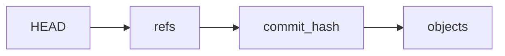

------------------------------------------------------------------------

## Object Model

Gitter implements three primitive object types:

### Blob

Represents file content. Serialized deterministically and hashed via SHA-1.

### Tree

Represents a full snapshot of file path → blob hash mappings at commit time.

### Commit

Represents: 
- Tree reference 
- Parent commit reference 
- Author 
- Timestamp 
- Message

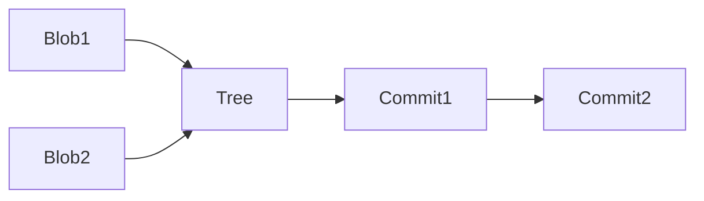

Objects are append-only. Parent references create a singly-linked commit
graph.

------------------------------------------------------------------------

## Installation

### Development Setup

``` bash
python -m venv .venv
source .venv/bin/activate
pip install -e .
```

### Run Tests

``` bash
pytest --cov=gitter --cov-fail-under=90
```

------------------------------------------------------------------------

## Quickstart

``` bash
mkdir demo
cd demo

gitter init

echo "hello" > file.txt
gitter add file.txt
gitter commit -m "initial commit"

gitter branch dev
gitter checkout dev

echo "feature work" >> file.txt
gitter commit -am "update on dev"

gitter checkout main
gitter log

gitter reset HEAD~1
gitter status
```

Demonstrates initialization, branching, auto-staging, reset, and history
traversal.

------------------------------------------------------------------------

## Supported Commands

  |Command                         |Description
  |------------------------------- |------------------------------|
  |`gitter init`|                     Initialize repository           |
  |`gitter add <file\|pattern>`|       Stage files (glob supported)   |
  |`gitter commit -m`|                Create commit                   |
  |`gitter commit -am`|               Auto-stage tracked changes      |
  |`gitter status`|                   Show working tree state         |
  |`gitter log`|                      Traverse commit history         |
  |`gitter branch`|                   List branches                   |
  |`gitter branch <name>`|            Create branch                   |
  |`gitter checkout <branch>`|        Switch branch                   |
  |`gitter checkout -b <branch>`|     Create & switch                 |
  |`gitter reset HEAD~n`|             Move branch pointer backward    |
  |`gitter help`|                     Command help                    |

------------------------------------------------------------------------

Outputs are regex-validated for strict compliance.

## Branch & Commit Graph Model

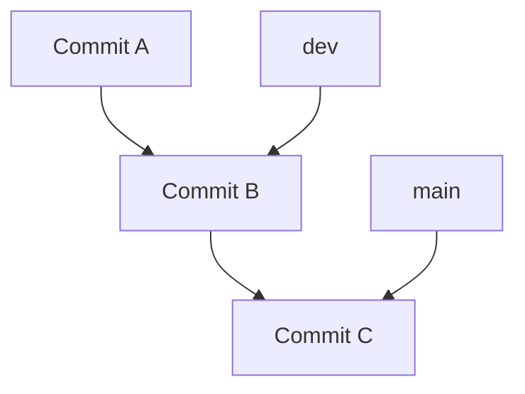

-   Branches are simple pointers to commit hashes.
-   HEAD is a symbolic reference to a branch.
-   Reset moves branch pointer.
-   Checkout changes HEAD target branch.

------------------------------------------------------------------------

## Reset Semantics

-   Supports `HEAD~n` traversal.
-   Moves current branch reference backward.
-   Does not modify object store.
-   Prevents traversal beyond initial commit.
-   Clears staging area.

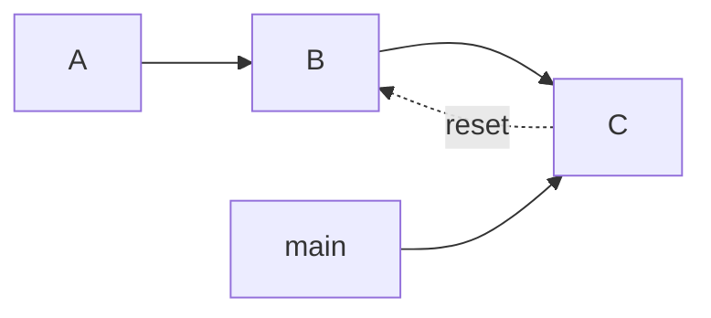

Reset is pointer movement only.

------------------------------------------------------------------------

## Checkout Semantics

-   Validates branch existence.
-   Updates HEAD symbolic reference.
-   Reconstructs working tree from target commit.
-   Clears staging area.

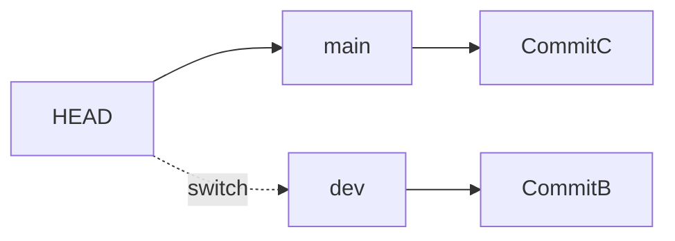

`checkout -b` creates and switches branch atomically.

------------------------------------------------------------------------

## Performance Considerations

-   Append-only object store.
-   SHA-1 hashing cost is linear in object size.
-   Commit traversal cost is linear in commits walked.
-   Entire index serialized on save.
-   Snapshot storage favors correctness over diff-based optimization.

No caching or packfile optimization implemented.

------------------------------------------------------------------------

## Testing Strategy

Three layers of testing:

### 1. Unit Tests

-   Storage layer
-   Index layer
-   Repository service
-   HEAD & refs semantics

### 2. CLI Tests

-   Command behavior
-   Error conditions
-   Edge cases

### 3. Regex Compliance Tests

-   Strict validation of CLI output formatting
-   Required by specification

### 4. Integration Flows

-   Full lifecycle flows
-   Branch switching scenarios
-   Reset scenarios
-   Multi-commit graphs

Coverage enforced ≥90%.

------------------------------------------------------------------------

## CI / Quality Gates

GitHub Actions pipeline enforces:

-   Pytest execution with coverage threshold
    -   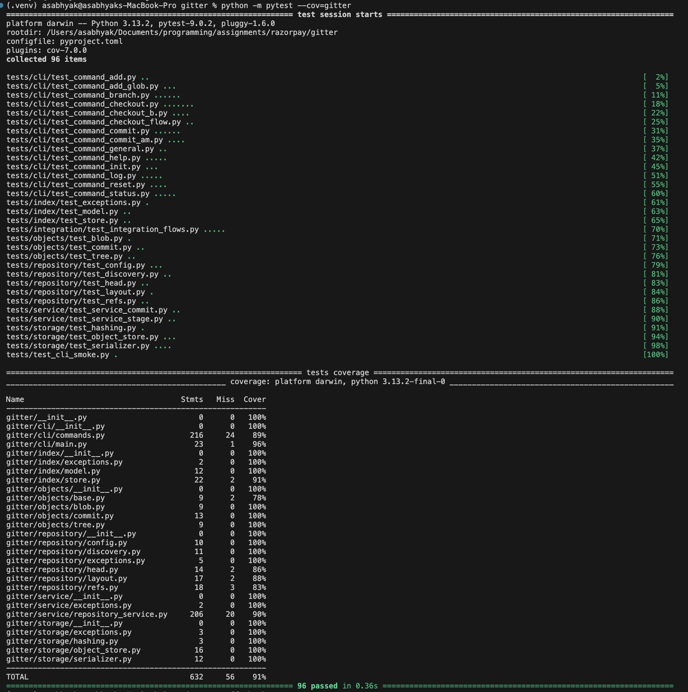
-   Ruff linting
    -   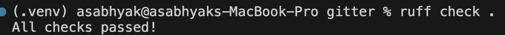
-   Bandit security scan
    -   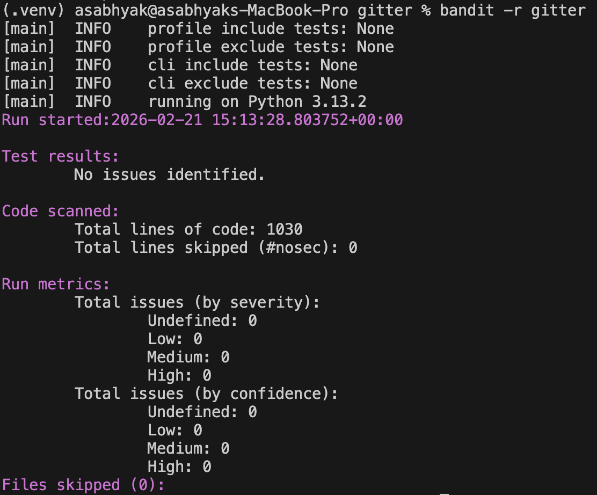

Runs on: 
- Push to `main` 
- Push to `development` 
- Pull requests

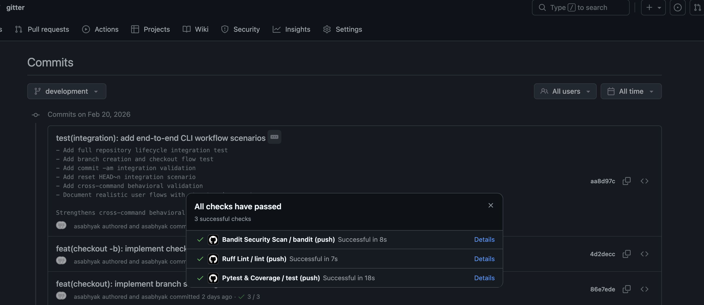

------------------------------------------------------------------------

## Architectural Layers

    gitter/
     ├── cli/          # CLI entry & command handlers
     ├── service/      # Orchestration layer
     ├── repository/   # Metadata management (HEAD, refs)
     ├── index/        # Staging abstraction
     ├── objects/      # Blob, Tree, Commit
     ├── storage/      # Serialization + object store

Layering ensures:

-   Clear responsibility separation
-   Deterministic behavior
-   No circular dependencies
-   High testability

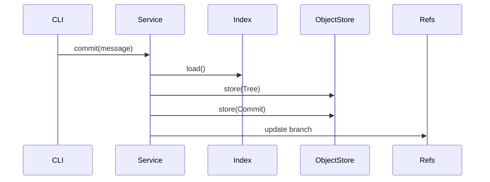

------------------------------------------------------------------------

## License

MIT License

------------------------------------------------------------------------

## Future Enhancements

-   Merge support
-   Detached HEAD
-   Garbage collection
-   Reflog
-   Packfile optimization
-   Diff support
-   Remote push/pull

------------------------------------------------------------------------
